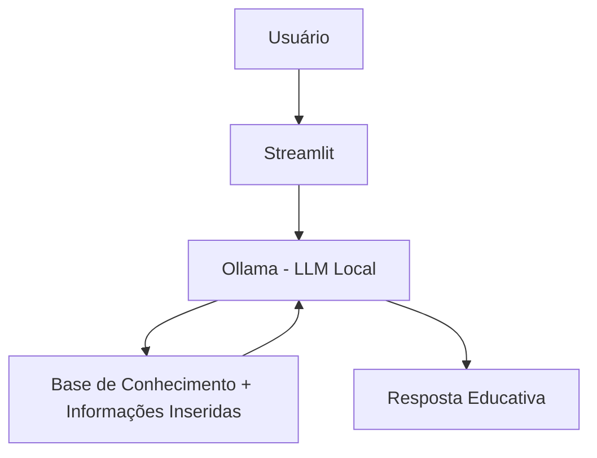

Incluído para a finalização do bootcamp!

# 🕹️ AIControl - Controlador Financeiro

## 💡 O Que é o AIControl?

O AIControl é uma agente que te ajuda a controlar seu gastos mensais, estabelecidos por metas que você mesmo pode estipular.

**O que o AIControl faz:**
- ✅ Compara seu gastos Mês a Mês
- ✅ Recomenda economias, gastos que podem ser evitados
- ✅ Fornece feedback de como está a sua evolução e quanto você já economizou até agora ou se não está indo tão bem e como pode melhorar
- ✅ Analisa padrões de gastos e sugere mudanças

**O que o AIControl NÃO faz:**
- ❌ Não recomenda investimentos específicos
- ❌ Não acessa dados bancários sensíveis
- ❌ Não substitui um profissional certificado
- ❌ Não busca melhores preços

## 🏗️ Arquitetura



**Stack:**
- Interface: Streamlit
- LLM: Ollama (modelo local `gpt-oss`)
- Dados: JSON/CSV mockados<br>
    Perfil so usuário<br>
    Gastos Mensair<br>
    Histórico<br>
    Metas

## 📁 Estrutura do Projeto

```
├── 📦 aicontrol/
|
├── data/                          # Base de conhecimento
│   ├── perfil_usuario.json        # Perfil do financeiro do usuário
│   ├── transacoes.csv             # Gastos informados no dia a dia
|   ├── resumo_mensal.csv          # Consolidado por mês
│   ├── historico_interacoes.csv   # Conversas anteriores com o agente
│   └── categorias.json            # Categorias e regras de gastos
│
├── docs/                          # Documentação do projeto
│   ├── 01-visao_geral.md          # Conceito do AIControl e problema resolvido
│   ├── 02-persona.md              # Perfil do usuária-alvo
│   ├── 02-modelo-dados.md         # Estrutura dos dados (JSON/CSV)
│   ├── 03-prompts.md              # System prompt e prompts auxiliares
│   ├── 04-metricas.md             # Critérios de avaliação
│   └── 05-pitch.md                # Apresentação do projeto
│
├── src/
|   └── app.py                     # Aplicação Streamlit
|   └── agente.py                  # Lógica do AI financeiro
|   └── dados.py                   # Leitura e escrita dos dados
|   └── analises.py                # Comparações e indicadores
|
└── Readme.md                      # Instruções rápidas
```

## 🚀 Como Executar

### 1. Instalar Ollama

```bash
# Baixar em: ollama.com
ollama pull gpt-oss
ollama serve
```

### 2. Instalar Dependências

```bash
pip install streamlit pandas requests
```

### 3. Rodar o Edu

```bash
streamlit run src/app.py
```

## 🎯 Exemplo de Uso

**Pergunta:**  
"Quanto eu já gastei este mês?"

**Resposta:**  
"Até agora, você gastou R$ 3.420 em março.  
Seu maior gasto foi com **Moradia (R$ 1.500)**, seguido de **Alimentação (R$ 980)**.  
Com base na sua renda, ainda restam R$ 580 disponíveis para atingir sua meta de economia."

---


**Pergunta:**  
"Onde estou gastando mais do que o normal?"

**Resposta:**  
"Comparando março com fevereiro, houve um aumento de **32% em gastos com delivery**.  
A maior concentração ocorreu após o dia 15.  
Se você reduzir pedidos em 2 dias da semana, economiza cerca de R$ 240 no mês."

---


**Pergunta:**  
"Estou conseguindo economizar?"

**Resposta:**  
"Sua meta mensal é economizar R$ 1.000.  
Neste mês, sua economia estimada está em **R$ 820**, o que representa **82% da meta**.  
Em fevereiro você atingiu 75%. Há uma evolução positiva ✅."

---

**Pergunta:**  
"O que você considera gasto desnecessário neste mês?"

**Resposta:**  
"Com base no seu histórico, os gastos considerados menos eficientes foram:  
- Delivery fora do horário de trabalho (R$ 310)  
- Compras por impulso em aplicativos (R$ 180)

Esses valores representam 12% do seu total mensal.  
Posso sugerir alternativas mais equilibradas se quiser."


## 📊 Métricas de Avaliação

| Métrica | Objetivo |
|---------|----------|
| **Assertividade** | O agente responde o que foi perguntado? |
| **Segurança** | Evita inventar informações (anti-alucinação)? |
| **Coerência** | A resposta é adequada ao perfil do cliente? |

## 🎬 Diferenciais

- **Personalização:** Usa os dados do próprio cliente nos exemplos
- **100% Local:** Roda com Ollama, sem enviar dados para APIs externas
- **Seguro:** Estratégias de anti-alucinação documentadas

## 📝 Documentação Completa

Toda a documentação técnica, estratégias de prompt e casos de teste estão disponíveis na pasta (informações da pasta).

